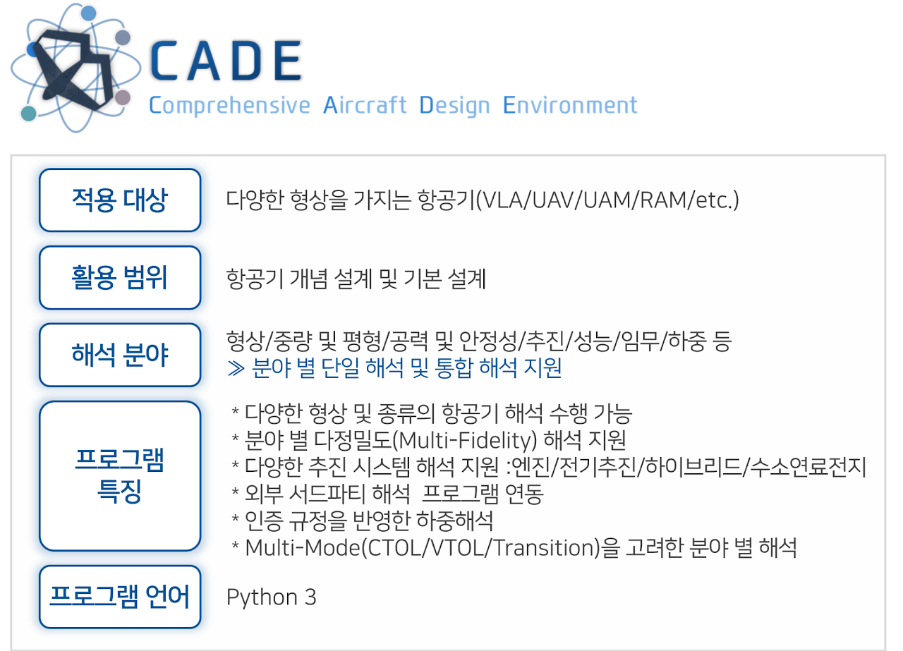

<p align="center">
  
</p>

<h2 align="center">CADE - Comprehensive Aircraft Design Environment</h2>

<p align="center">
  <a href="https://github.com/kada/cade/issues"></a>
  <a href="https://github.com/kada/cade/actions"></a>
  <a href="https://sites.google.com/view/kadalab/members/students"></a>
  <a href="LICENSE"></a>
</p>

---

## 📌 Table of Contents

- [Introduction](#introduction)
- [Demo](#demo)
- [How to Get It](#how-to-get-it)
- [Documentation & Tutorials](#documentation--tutorials)
- [Participate](#participate)
  - [Paper](#paper)
  - [Contribute](#contribute)
  - [Who is Using CADE?](#who-is-using-cade)
- [Contact](#contact)
- [Code of Conduct](#code-of-conduct)
- [License](#license)

---

## Introduction

**CADE**는 *Comprehensive Aircraft Design Environment*의 약자로, 초기 설계부터 개념 설계까지의 항공기 설계에 있어 전체적인 플랫폼을 구축하고 프로세스를 제공하는데 목적을 둔다.

CADE 내 다분야 해석(Multi-Disciplinary Analysis, MDA) 모듈 내에는 다음과 같은 7가지 모듈을 제공한다:

| Module | Description |
|--------|-------------|
| Configuration | 항공기 구성 설정 |
| Weight & Balance | 무게 및 균형 계산 |
| Aerodynamic & Stability N Control | 공기역학 및 안정성, 제어 |
| Propulsion | 추진 시스템 |
| Performance & Mission | 성능 및 임무 분석 |
| Load | 하중 분석 |
| Sizing | 크기 및 구조 설계 |

이 모듈들을 통해 항공기의 초기 설계와 단일 및 통합 분야 해석을 지원한다.

---

## Demo

🎬 **Check out the quick 1.5 minute demo:**  

[](https://www.youtube.com/watch?v=79xQfS5-f30)

---

## How to Get It

### Windows
[](https://github.com/kada/cade/actions/workflows/test_windows.yml)
* [Download CADE](https://github.com/Microsoft/AirSim/releases)

---

### Documentation

📖 [Detailed documentation](http://203.252.161.200:8000/) on all aspects of CADE.  

## Tutorials

- 🎥 [Video Tutorial - Using CADE](https://youtu.be/example) by KADA CADE Team

---

## Participate

### Paper

More technical details are available in [CADE paper (Journal or Conference Name)](URL). Please cite as: 
```
@inproceedings{airsim2017fsr,
  author = {e.g., Zin, MinJi},
  title = {CADE},
  year = {2025},
  booktitle = {Field and Service Robotics},
  eprint = {Link},
  url = {Link}
}
```

### Contribute

Please take a look at [open issues](https://github.com/kada/cade/issues) if you are looking for areas to contribute.

* [More on CADE design](https://sites.google.com/view/kadalab/projects/cade)

### Who is Using CADE?

We are maintaining a [list](https://github.com/kada/cade/cade-users) of projects, people, and groups in the aircraft design community.

If you want to be featured, [make a request here](https://github.com/kada/cade/issues).

---

## Contact

💬 Join our [GitHub Discussions](https://github.com/kada/cade/discussions) to stay up to date or ask questions.  

🏘️ KADA group on [Facebook](https://www.facebook.com/groups/number_id/).  

❔ For questions, contact developer **Zin Win Thu**. Email at [this link](https://sites.google.com/view/kadalab/members/students).

---

## Code of Conduct

⚠️ The source code for CADE is **not publicly available**. Please contact the developers for access or inquiries.

---

## License

🪪 This project is released under the **EXAMPLE License**. See the [License file](LICENSE) for more details.